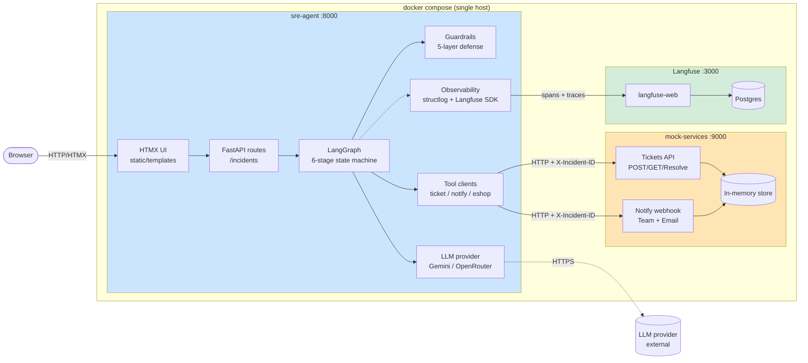

# C4 — Containers

**Type:** C4 Container
**Purpose:** Show the containers in the Docker Compose stack, their tech, their responsibilities, and which ports are exposed to the host.

**Exposed host ports:** `8000` (UI/API), `9000` (mock services), `3000` (Langfuse UI). No others.

**Legend:**
- **Blue** → application container
- **Orange** → mock container (production-swap boundary)
- **Green** → observability container
- **Solid arrows** → in-cluster HTTP
- **Dotted arrow** → outbound to public LLM provider

**Why this layout:**
- Agent and mocks are physically separated → the production migration is "change the URL", nothing else.
- Langfuse runs on the same compose so judges can see live traces during the demo without setting up SaaS.
- Only three host ports, matching the brief's "expose only necessary ports" requirement.
