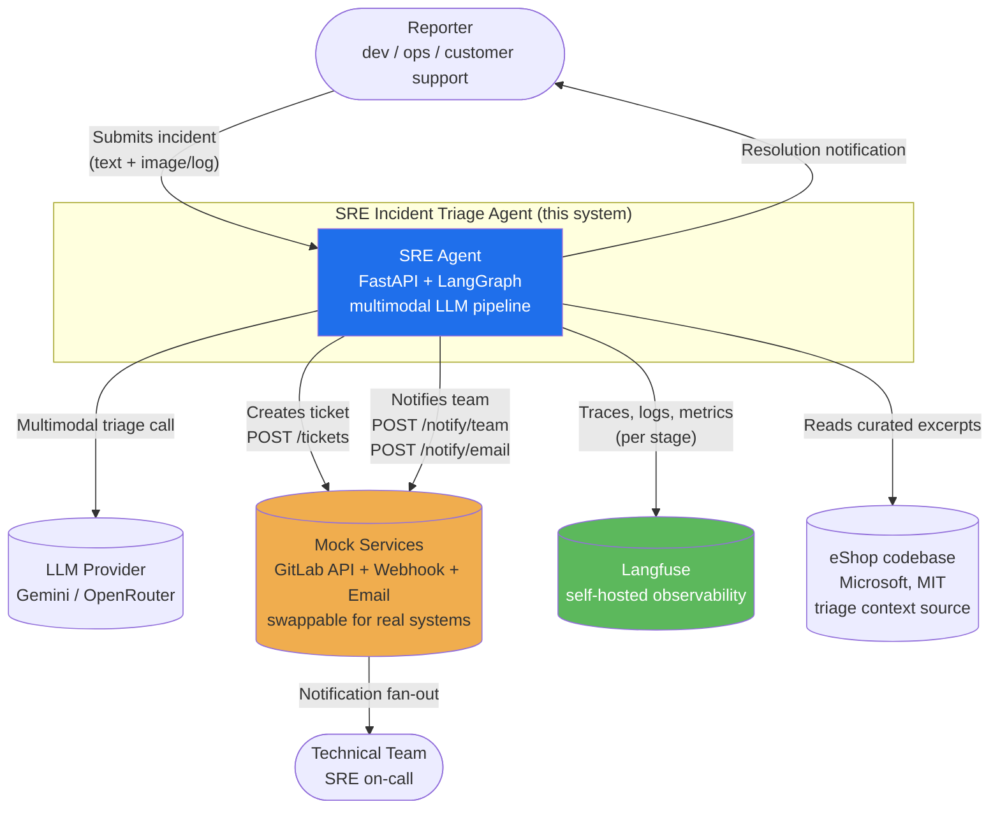

# C4 — System Context

**Type:** C4 Context
**Purpose:** Show who uses the SRE Incident Triage Agent and which external systems it integrates with (real and mocked).

**Legend:**
- **Blue** → the system being built
- **Orange** → mocked dependency (production-swap path documented in `SCALING.md`)
- **Green** → observability backbone
- **Gray** → external real-world entities

**Notes:**
- The reporter and the technical team are real human actors but interact only via the UI and the (mocked) notification channels.
- eShop is the *target codebase the agent analyzes for context*, NOT the codebase of this project.
- All "Mock Services" arrows point to a single container that swaps cleanly for real GitLab + Slack + email in production.
