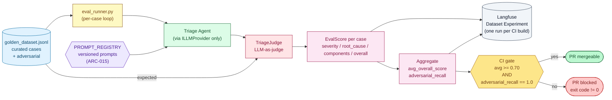

# Evaluation Pipeline — LLM-as-judge

**Type:** Flow (Mermaid `flowchart LR`)
**Purpose:** Show how the offline evaluation pipeline runs the Triage Agent against the golden dataset, scores it with the LLM-judge, logs the run as a Langfuse Dataset Experiment, and gates the CI build.

## Legend

- **golden_dataset.jsonl** — Curated cases (normal + adversarial). Schema in `ARCHITECTURE.md` §4.5.
- **eval_runner.py** — Iterates the dataset, invokes the Triage Agent **only through `ILLMProvider`** (no shortcuts that bypass the agent under test).
- **PROMPT_REGISTRY (ARC-015)** — All prompts the agent uses are resolved here; the runner asserts no inline prompts leak through.
- **TriageJudge** — LLM-as-judge that compares the agent output against the expected fields and emits an `EvalScore`.
- **EvalScore** — Per-case score; aggregated across the dataset.
- **Langfuse Dataset Experiment** — Each CI build is a new run; trends over time live here.
- **CI gate (ARC-016)** — Hard gate. Fails the build if either threshold is breached.

See `ARCHITECTURE.md` §4.5 for the contract and §5 rules ARC-015 / ARC-016.
