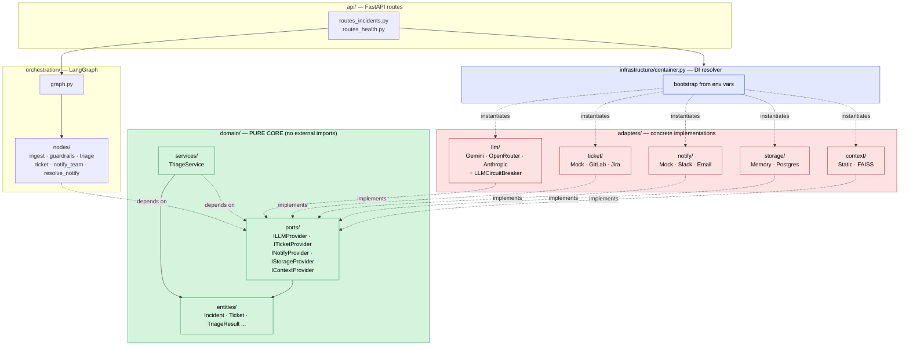

# Hexagonal Overview — sre-agent

**Type:** Component diagram (hexagonal layering)
**Purpose:** Show how the pure domain depends only on ports, and how `infrastructure/container.py` is the single place that resolves concrete adapters from environment variables.

**Legend:**
- **Green** = pure domain. Zero framework imports. Unit-testable in isolation.
- **Red** = adapters. Depend on external SDKs (Gemini, httpx, SQLAlchemy, FAISS, ...). Implement port interfaces.
- **Blue** = infrastructure. The only file in the codebase that knows concrete adapter classes.
- Solid arrows = compile-time imports. Dashed arrows = runtime instantiation / interface implementation.

**Rule reminder:** `orchestration/nodes/` and `domain/services/` may import only from `domain/ports/`. They never import a concrete adapter. The container is the seam.
