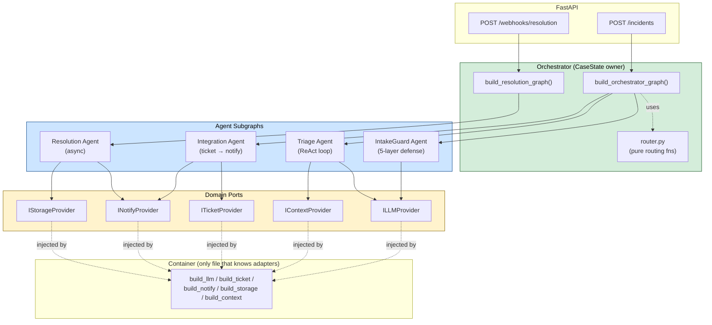

# Multi-Agent Topology

**Type:** Component
**Purpose:** Show the four agents, the orchestrator that owns CaseState, and how each agent depends only on ports (never on adapters). Use this diagram to onboard new contributors to the agent layer in under 60 seconds.

**Legend:**
- **Solid arrows** = runtime invocation (graph edges, port calls).
- **Dashed arrows** = build-time wiring (router consulted by graph; ports populated by container).
- The orchestrator is the **only** writer of `CaseState`. Each agent subgraph receives an immutable `Projection` and returns one `AgentEvent` (ARC-013).
- Note that `IN`tegration and `RS` Resolution live in **different compiled graphs** — Resolution is never on the synchronous path (ARC-014).
