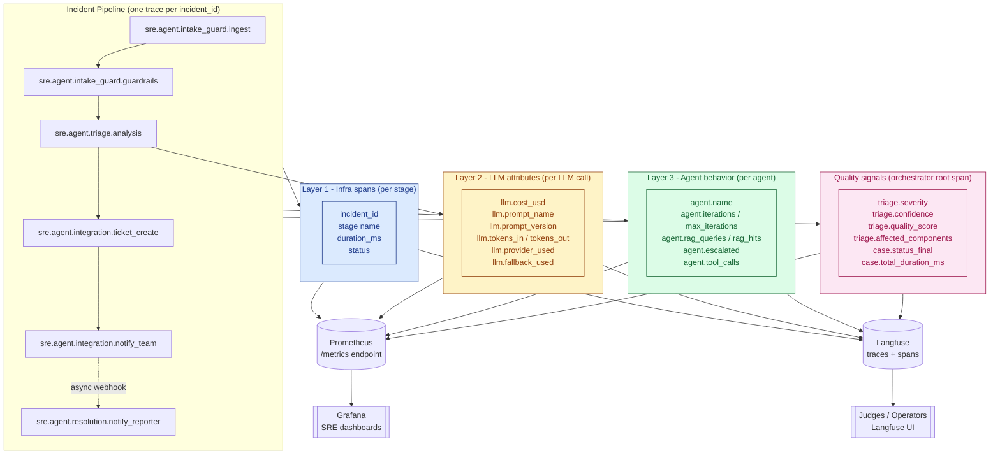

# Observability Layers — v2

**Type:** Component (Mermaid `graph TD`)
**Purpose:** Show the three observability layers defined in `ARCHITECTURE.md` §4 (infra spans, LLM attributes, agent behavior attributes) and how they fan out to Langfuse (traces) and Prometheus / Grafana (metrics).

## Legend

- **Layer 1 (blue)** — Infra spans, one per pipeline stage. Always emitted, even if no LLM is involved.
- **Layer 2 (yellow)** — LLM attributes. Attached to spans that wrap an `ILLMProvider` call.
- **Layer 3 (green)** — Agent behavior. Attached to the root span of each agent subgraph invocation.
- **Quality signals (pink)** — Outcome attributes attached to the orchestrator's root span (one per incident).
- **Langfuse** — Receives full trace tree with all attributes; used by humans for debugging and by the eval pipeline as the run store.
- **Prometheus** — Pulls counters/histograms/gauges from the agent's `/metrics` endpoint for time-series dashboards.

See `ARCHITECTURE.md` §4 for the complete contract and §4.6 for the metrics list.
