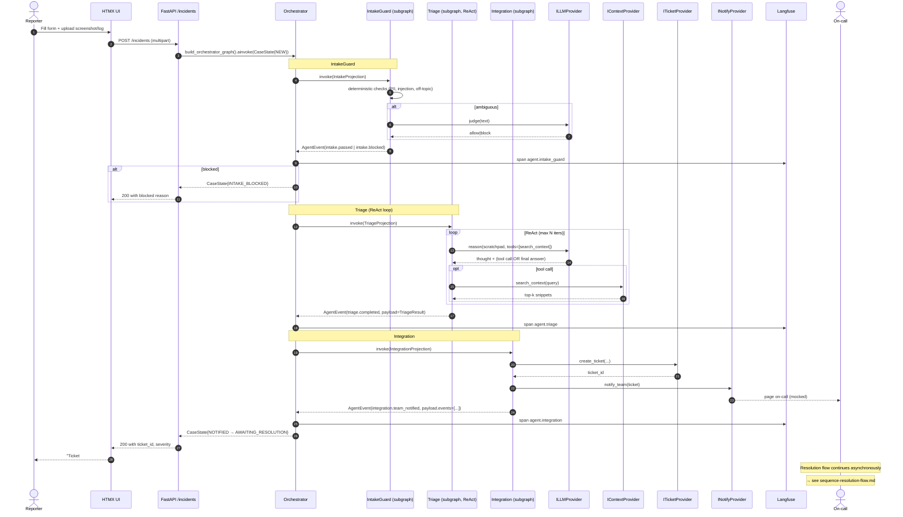

# Sequence — End-to-End Incident Flow (Multi-Agent)

**Type:** Sequence
**Purpose:** Show the synchronous incident flow as it traverses the orchestrator and the three sync agents (IntakeGuard → Triage → Integration). Resolution lives in `sequence-resolution-flow.md` because it is async (ARC-014).

**Legend:**
- **The orchestrator is the single mutation point for `CaseState`** (ARC-013). Each agent returns ONE `AgentEvent`; the orchestrator folds it into state.
- **Every agent invocation emits a Langfuse span** keyed on `case_id`, so the full multi-agent run is one trace.
- **Resolution is intentionally absent** from this diagram — it lives in `sequence-resolution-flow.md` and runs in `build_resolution_graph()`, triggered by webhook.
- **ReAct cap:** the Triage Agent enforces `max_iterations` (see `BaseAgent.max_iterations`) to prevent runaway loops.
