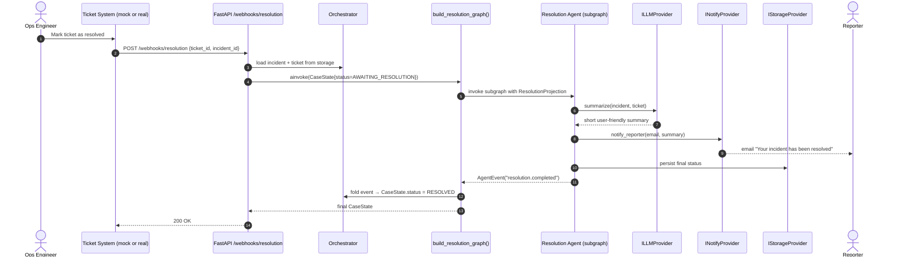

# Sequence — Async Resolution Flow

**Type:** Sequence
**Purpose:** Show the asynchronous resolution path triggered by the ticket system webhook. This is intentionally decoupled from the synchronous incident graph (DEC-006 / ARC-014) so the API response time is bounded.

**Legend:**
- **Compiled graph isolation:** the resolution graph is built independently of the synchronous orchestrator graph. They share `CaseState` schema but never share a single execution.
- **Single mutation point:** the orchestrator (not the agent) folds the `AgentEvent` into `CaseState`.
- In the hackathon demo, "Mark as resolved" is a UI button hitting the mock ticket service, which then calls the webhook (DEC-004 + DEC-006).
