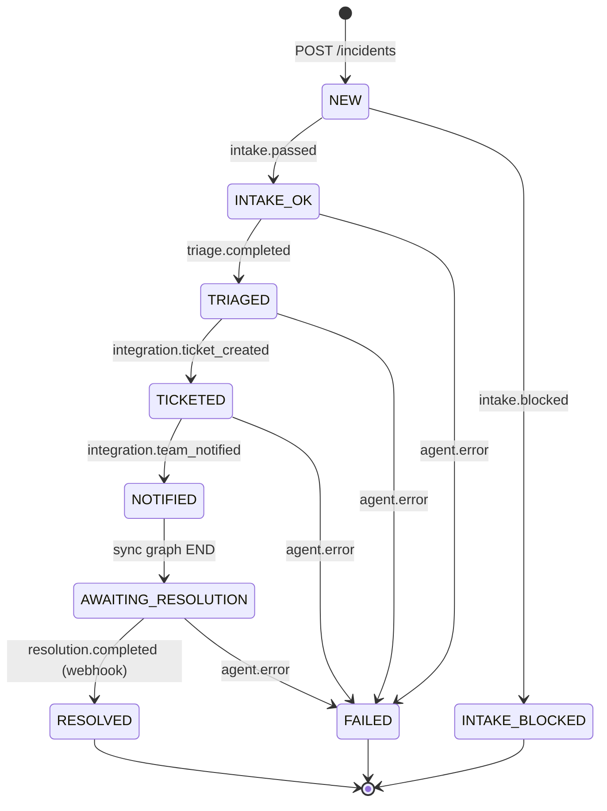

# State — Case Lifecycle

**Type:** State
**Purpose:** Define the canonical lifecycle of a `CaseState` as it is mutated by the orchestrator in response to `AgentEvent`s. This is the contract every agent must respect.

**Legend:**
- Each transition is triggered by an `AgentEvent` returned from a subgraph and applied by the orchestrator.
- `AWAITING_RESOLUTION` is the boundary between the synchronous incident graph and the asynchronous resolution graph (ARC-014).
- `FAILED` is reachable from any non-terminal state when an agent emits `agent.error`.
- `INTAKE_BLOCKED` is terminal — the case never reaches triage. Used to enforce the 5-layer prompt-injection defense.
